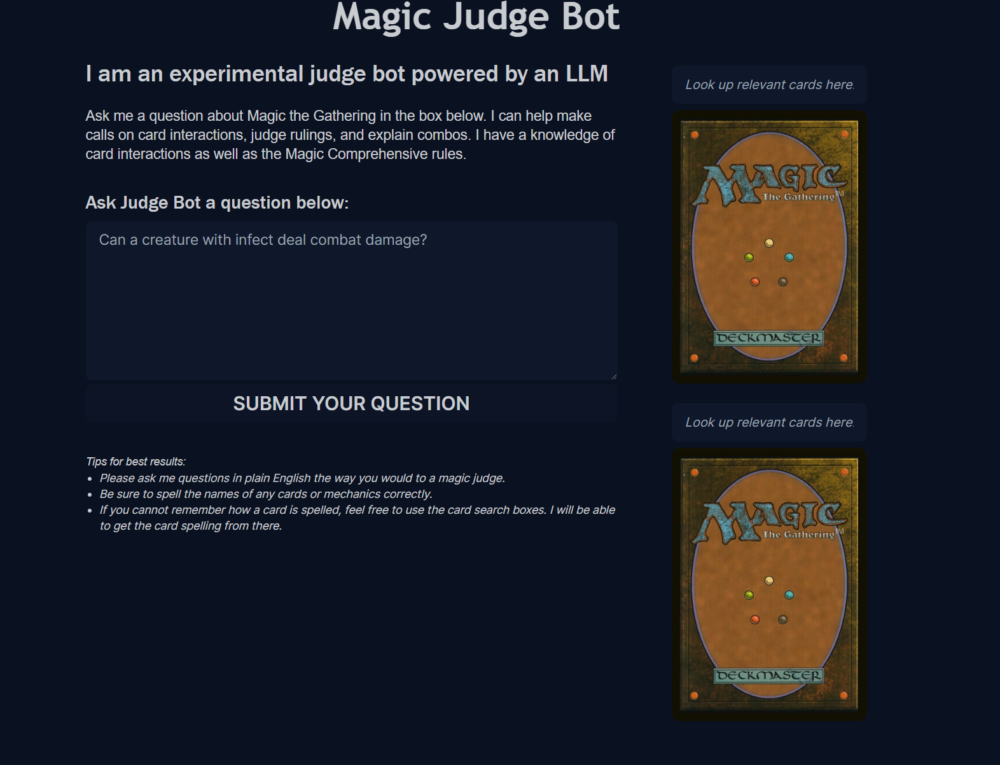

# Magic Judgebot LLM



This is an experimental LLM application which leverages LangChain, prompt engineering and Retreival-Augmented Generation (RAG) to create an AI agent with expert knowledge of the Magic the Gathering card game. Judge Bot has access to all of the rules and card data in Magic the Gathering, and can use the power of AI to help explain card interactions, answer questions about game rules, and more.

## JudgeBot API
This site works by making requests to the [Magic JudgeBot API](https://github.com/manski117/magic-judge-rag), also developed by manski117. 

## Getting Started

First, run the development server:

```bash
npm run dev
# or
yarn dev
# or
pnpm dev
# or
bun dev
```

Open [http://localhost:3000](http://localhost:3000) with your browser to see the result.


